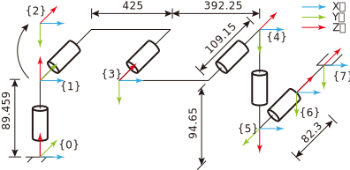

1. [UR5 configuration](#✨-ur5-configuration)
1. [Jacobian of UR5](#✨-jacobian-of-ur5)
1. [Inverse kinematics](#✨-inverse-kinematics)
1. [Appendix A. ur\_kinematics.m](#✨-appendix-a.-ur_kinematics.m)
1. [Appendix B. ur\_simulate.m](#✨-appendix-b.-ur_simulate.m)

$$
\mathcal{V}
$$
## ✨ UR5 configuration


Link parameters of the UR5 (**Modified DH**).

| $i$ | $\alpha_{i-1}$ | $a_{i-1}$ | $d_i$  | $\theta_i$ |
|-----|----------------|-----------|--------|------------|
| 1   | 0              | 0         | 89.459 |            |
| 2   | $-\pi/2$       | 0         | 0      |            |
| 3   | 0              | 425       | 0      |            |
| 4   | 0              | 392.25    | 109.15 |            |
| 5   | $-\pi/2$       | 0         | 94.65  |            |
| 6   | $\pi/2$        | 0         | 82.3   |            |

改进 DH 坐标法的齐次变换矩阵为: 
$$
^{i-1}_iT = \left[ {\begin{array}{cccc}
c\theta_i & -s\theta_i & 0 & a_{i-1} \\
s\theta_ic\alpha_{i-1} & c\theta_ic\alpha_{i-1} & -s\alpha_{i-1} & -s\alpha_{i-1}d_i \\
s\theta_is\alpha_{i-1} & c\theta_is\alpha_{i-1} & c\alpha_{i-1} & c\alpha_{i-1}d_i \\
0 & 0 & 0 & 1
\end{array}} \right]
$$

### 指数积公式的物体坐标表示形式
初始状态下，工具坐标系相对于基坐标系的齐次转换矩阵如下，
其中$\Delta x_i$ 为工具相对于末端坐标系(end\_link)的位置补偿。
$$
M = \left[ {\begin{array}{ccc}
1 & 0 & 0 & 817.25+\Delta x \\
0 & 0 & 1 & 191.45+\Delta z \\
0 & -1 & 0 & -5.191-\Delta y \\
0 & 0 & 0 & 1
\end{array}} \right]
$$

每个关节螺旋轴相对于工具坐标系的旋量坐标为如下：
| $i$ | $\omega_i$   | $v_i$                                          |
|-----|--------------|------------------------------------------------|
| 1   | $[0,-1,0]^T$ | $[-(d_4+d_6+\Delta z), 0, a_2+a_3+\Delta x]^T$ |
|     |              | $[-191.45, 0, 817.25]$                          |
| 2   | $[0,0,1]^T$  | $[-(d_5+\Delta y), a_2+a_3+\Delta x, 0]^T$     |
|     |              | $[-94.65, 0, 817.25]$                          |
| 3   | $[0,0,1]^T$  | $[-(d_5+\Delta y), a_3+\Delta x, 0]^T$         |
|     |              | $[-94.65, 392.25, 0]$                          |
| 4   | $[0,0,1]^T$  | $[-(d_5+\Delta y), 0, 0]^T$                    |
|     |              | $[-94.65, 0, 0]$                               |
| 5   | $[0,1,0]^T$  | $[d_6+\Delta z, 0, 0]^T$                       |
|     |              | $[82.3, 0,0]$                                  |
| 6   | $[0,0,1]^T$  | $[\Delta x, \Delta y, \Delta z]^T$             |

正运动学方程为：
$$
\begin{array}{cl}
T(\theta) &=  Me^{[S_1]\theta_1}e^{[S_2]\theta_2}\cdots e^{[S_6]\theta_6}\\
 &=e^{[B_1]\theta_1}e^{[B_2]\theta_2}\cdots e^{[B_6]\theta_6}M
\end{array}
$$
式中
$$
e^{[S]\theta} = \left[ {\begin{array}{cc}
e^{[\omega]\theta} & (I\theta +(1-cos\theta)[\omega]+(\theta-sin\theta)[\omega]^2)v \\
0 & 1 \\
\end{array}} \right]
$$
$$
B_i = [Ad_{M^{-1}}]S_i
$$


## ✨ Jacobian of UR5
### 位置分量
固连在关节 6 上的坐标系的原点位置表达式如下:
$$
{\bf{r}} = \left[ {\begin{array}{c}
{{a_2}{c_1}{c_2} + {a_3}{c_1}{c_{23}} - {d_4}{s_1} - {d_5}{c_1}{s_{234}} - {d_6}{s_1}{c_5} + {d_6}{c_1}{c_{234}}{s_5}}\\
{{a_2}{s_1}{c_2} + {a_3}{s_1}{c_{23}} + {d_4}{c_1} - {d_5}{s_1}{s_{234}} + {d_6}{c_1}{c_5} + {d_6}{s_1}{c_{234}}{s_5}}\\
d_1 - a_2s_2 - a_3s_{23} - d_5c_{234} - d_6s_{234}s_5
\end{array}} \right]
$$

由$\delta {\bf{r}} = {J_r}\delta \theta$ 得，
Jacobian 矩阵线速度分量 $J_r$ 的各列分别如下:
$$
\begin{array}{l}
\frac{\partial \bf{r}}{\partial \theta_1} =
\left[ {\begin{array}{c}
{-({a_2}{c_2} + {a_3}{c_{23}} - {d_5}{s_{234}} + {d_6}{c_{234}}{s_5}){s_1} - ({d_4} + {d_6}{c_5}){c_1}}\\
{ - ({d_4} + {d_6}{c_5}){s_1} + ({a_2}{c_2} + {a_3}{c_{23}} - {d_5}{s_{234}} + {d_6}{c_{234}}{s_5}){c_1}}\\
0
\end{array}} \right] \\

\frac{\partial \bf{r}}{\partial \theta_2} =
\left[ {\begin{array}{c}
-c_1(a_2s_2 + a_3s_{23} + d_5{c_{234}} + d_6s_{234}s_5) \\
-s_1(a_2s_2 + a_3s_{23} + d_5{c_{234}} + d_6s_{234}s_5) \\
-a_2c_2 - a_3c_{23} + d_5{s_{234}} - d_6{c_{234}}{s_5}
\end{array}} \right] \\

\frac{\partial \bf{r}}{\partial \theta_3} =
\left[ {\begin{array}{c}
{ - {c_1}({a_3}{s_{23}} + {d_5}{c_{234}} + {d_6}{s_{234}}{s_5})}\\
{ - {s_1}({a_3}{s_{23}} + {d_5}{c_{234}} + {d_6}{s_{234}}{s_5})}\\
-a_3c_{23} + {d_5}{s_{234}} - {d_6}{c_{234}}{s_5}
\end{array}} \right] \\

\frac{\partial \bf{r}}{\partial \theta_4} =
\left[ {\begin{array}{c}
-c_1({d_5}{c_{234}} + {d_6}{s_{234}}{s_5})\\
-s_1({d_5}{c_{234}} + {d_6}{s_{234}}{s_5})\\
{d_5}{s_{234}} - {d_6}{c_{234}}{s_5}
\end{array}} \right] \\

\frac{\partial \bf{r}}{\partial \theta_5} =
\left[ {\begin{array}{c}
d_6({s_1}{s_5} + {c_1}{c_{234}}{c_5})\\
d_6( - {c_1}{s_5} + {s_1}{c_{234}}{c_5})\\
-{d_6}{s_{234}}{c_5}
\end{array}} \right] \\

\frac{\partial \bf{r}}{\partial \theta_6} = 
\left[ {\begin{array}{c}
0 \\ 0 \\ 0
\end{array}} \right]
\end{array}
$$

### 姿态分量
与关节 6 固联的坐标系的角速度为:
$$
^0_6\omega = \left[ {\begin{array}{c}
-s1(\dot\theta_2+\dot\theta_2+\dot\theta_3) -c_1s_{234}\dot\theta_5 +(-s_1c_5+c_1c_{234}s_5)\dot\theta_6 \\
c1(\dot\theta_2+\dot\theta_2+\dot\theta_3) -s_1s_{234}\dot\theta_5 +(c_1c_5+s_1c_{234}s_5)\dot\theta_6 \\
\dot\theta_1 -c_{234}\dot\theta_5 -s_{234}s_5\dot\theta_6
\end{array}} \right]
$$

由 ${^0_6\omega} = J_\omega\dot q$ 得，
末端角速度对应的 Jacobian 矩阵分量的各列即为各关节角的角速度矢量:
$$
J_\omega = \left[ {\begin{array}{cc}
0 & { - {s_1}} & -s_1 & -s_1 & -c_1{s_{234}} &  - {s_1}{c_5} + {c_1}{c_{234}}{s_5} \\
0 & {{c_1}}    & c_1  & c_1  & -s_1{s_{234}} & {c_1}{c_5} + {s_1}{c_{234}}{s_5}    \\   
1 & 0          & 0    & 0    & -c_{234}      &  - {s_{234}}{s_5}                  
\end{array}} \right]
$$

**四元数法:**(貌似不行)
同理，末端相对于基坐标系的姿态为
$$
{}_6^0R = \left[ {\begin{array}{ccc}
{{s_1}{s_5}{c_6} + {c_1}{c_{234}}{c_5}{c_6} - {c_1}{s_{234}}{s_6}} &
{-{s_1}{s_5}{s_6} - {c_1}{c_{234}}{c_5}{s_6} - {c_1}{s_{234}}{c_6}} &
{{c_1}{c_{234}}{s_5} - {s_1}{c_5}} \\
{-{c_1}{s_5}{c_6} + {s_1}{c_{234}}{c_5}{c_6} - {s_1}{s_{234}}{s_6}} &
{{c_1}{s_5}{s_6} - {s_1}{c_{234}}{c_5}{s_6} - {s_1}{s_{234}}{c_6}} &
{{c_1}{c_5} + {s_1}{c_{234}}{s_5}}\\
{-{c_{234}}{s_6} - {s_{234}}{c_5}{c_6}} & 
{{s_{234}}{c_5}{s_6} - {c_{234}}{c_6}} & 
{ - {s_{234}}{s_5}}
\end{array}} \right]
$$

小角度下 ($q_w\to0$) 为避免使用除法进行计算，旋转矩阵转换为四元数的公式为[^quaternion]:
$$
4\left[\begin{array}{c}q_w^2\\q_x^2\\q_y^2\\q_z^2\end{array}\right] = 
\left[ {\begin{array}{cccc}
1 & 1 & 1 & 1 \\ 1 & -1 & -1 & 1 \\ -1 & 1 & -1 & 1 \\ -1 & -1 & 1 & 1
\end{array}} \right]
\left[ {\begin{array}{c}
r_{11} \\ r_{22} \\ r_{33} \\ 1
\end{array}} \right]
$$

以 $q_x$ 和 $\theta_1$ 对应的 Jacobian 分量为例，
将 $4q_x^2 = {r_{11}} - {r_{22}} - {r_{33}} + 1$ 两边同时对 $\theta_1$ 取微分得:

$$
\begin{array}{rl}
8{q_x}\frac{{\partial {q_x}}}{{\partial {\theta _1}}} =& 
\frac{{\partial {r_{11}}}}{{\partial {\theta _1}}} - 
\frac{{\partial {r_{22}}}}{{\partial {\theta _1}}} - 
\frac{{\partial {r_{33}}}}{{\partial {\theta _1}}}\\
\frac{{\partial {q_x}}}{{\partial {\theta _1}}} =& 
\frac{{\partial {r_{11}}/\partial {\theta _1} - 
\partial r_{22}/\partial {\theta _1} - \partial {r_{33}}/\partial {\theta _1}}}
{{4\sqrt {{r_{11}} - {r_{22}} - {r_{33}} + 1} }}
\end{array}
$$

下表展示了旋转矩阵中主对角线上的元素对各关节角的偏微分。
| $\partial r\mathord{\left/\right.}\partial q$ | r11   | r22   | r33   |
|:---:|:-----:|:-----:|:-----:|
| $\theta_1$ | $c_1s_5c_6-s_1c_{234}c_5c_6+s_1s_{234}s_6$  | $-s_1s_5s_6-c_1c_{234}c_5c_6-c_1s_{234}c_6$ | $0$ |
| $\theta_2$ | $-c_1s_{234}c_5c_6-c_1c_{234}s_6$           | $s_1s_{234}c_5s_6-s_1c_{234}c_6$ | $-c_{234}s_5$ |
| $\theta_2$ | $-c_1s_{234}c_5c_6-c_1c_{234}s_6$           | $s_1s_{234}c_5s_6-s_1c_{234}c_6$ | $-c_{234}s_5$ |
| $\theta_3$ | $-c_1s_{234}c_5c_6-c_1c_{234}s_6$           | $s_1s_{234}c_5s_6-s_1c_{234}c_6$ | $-c_{234}s_5$ |
| $\theta_5$ | $s_1c_5c_6-c_1c_{234}s_5c_6$                | $c_1c_5s_6+s_1c_{234}s_5s_6$ |     $-s_{234}c_5$ |
| $\theta_6$ | $-s_1s_5s_6-c_1c_{234}c_5s_6-c_1s_{234}c_6$ | $c_1s_5c_6-s_1c_{234}c_5c_6+s_1s_{234}s_6$ | $0$ |


## ✨ Inverse kinematics
> 注意关节角的范围为 $q_i \in (-\pi,\pi]$，因此需要将计算的角度转换到定义域后
再比较关节角的变化量。

已知 $^0_6T$ 求 $\theta_i$[^invKinematics]。记:
$$
^0_6T = \left[ {\begin{array}{cccc}
nx & ox & ax & px \\
ny & oy & ay & py \\
nz & oz & az & pz \\
0 & 0 & 0 & 1
\end{array}} \right]
$$

若已知$Acos\theta + Bsin\theta = d$ 则由辅助角公式和 atan2 函数可以求解$\theta$:
$$
\theta = {\rm atan2}(d,\pm\sqrt{A^2+B^2-d^2}) - {\rm atan2}(A,B)
$$

### 求关节角 1, 5, 6
齐次矩阵 $^1_5T$ 分别可以表示为:
$$
{^0_1T^{-1}}^0_6T{^5_6T^{-1}} = {^1_2T}{^2_3T}{^3_4T}{^4_5T}
$$
分别计算等式左右两边，得
$$
{^0_1T^{-1}}^0_6T{^5_6T^{-1}} = \left[ {\begin{array}{cccc}
c_6(n_xc_1+n_ys_1)-s_6(o_xc_1+o_ys_1) & -a_xc_1-a_ys_1 &
c_6(o_xc_1+o_ys_1)+s_6(n_xc_1+n_ys_1) & p_xc_1+p_ys_1-d_6(a_ys_1+a_xc_1) \\
c_6(n_yc_1-n_xs_1)+s_6(o_xs_1-o_yc_1) & a_xs_1-a_yc_1
& c_6(o_yc_1-o_xs_1)-s_6(n_xs_1-n_yc_1) & pyc_1-p_xs_1+d_6(a_xs_1-a_yc_1) \\
n_zc_6-o_zs_6 & -a_z
& o_zc_6+n_zs_6 & pz-d_1-a_zd_6 \\
0 & 0 & 0 & 1
\end{array}} \right]
$$

$$
{^1_2T}{^2_3T}{^3_4T}{^4_5T} = \left[ {\begin{array}{cccc}
c_{234}c_5  & -c_{234}s_5 & -s_{234} & a_3c_{23}+a_2c_2-d_5s_{234} \\
-s_5        & -c_5        & 0        & d_4 \\
-s_{234}c_5 & s_{234}s_5  & -c_{234} & -a_3s_{23}-a_2s_2-d_5c_{234} \\
0 & 0 & 0 & 1
\end{array}} \right]
$$

#### 关节角 1
由 $^1_5t_{24}$ 对应相等可以计算出 $\theta_1$
$$
(p_y-a_yd_6)c_1 + (-p_x+a_xd_6)s_1 = d_4
$$
记 $A_1 = p_y-a_yd_6, B_1 = -p_x+a_xd_6$ 则:
$$
\theta_1 = {\rm atan2}(d4,\pm\sqrt{A_1^2+B_1^2-d_4^2}) - {\rm atan2}(A_1,B_1)
$$
其中$A_1^2 + B_1^2 - d_4^2 \geq 0$ 。

#### 关节角 5
由 $^1_5t_{22}$ 对应相等可以计算出 $\theta_5$
$$ a_xs_1 - a_yc_1 = -c_5$$
$$ \theta_5 = {\pm\rm acos}(a_xs_1-a_yc_1) $$
其中$-1 \leq a_xs_1 - a_yc_1 \leq 1$ 。

#### 关节角 6
由 $^1_5t_{24}$ 对应相等可以计算出 $\theta_1$
$$
(n_yc_1-n_xs_1)c_6 + (-o_yc_1+o_xs_1)c_6 = -s_5
$$
记 $A_6 = n_yc_1-n_xs_1, B_6 = -o_yc_1+o_xs_1$ 则:
$$
\begin{array}{rl}
\theta_6 =& {\rm atan2}(-s5,0) - {\rm atan2}(A6,B6) \\
=& {\rm atan2}(-B6/s5,-A6/s5)
\end{array}
$$
其中$s_5 \neq 0$ 。

### 求关节角 2, 3, 4
齐次矩阵 $^1_4T$ 分别可以表示为:
$$
{^0_1T^{-1}}^0_6T{^5_6T^{-1}}{^4_5T^{-1}} = {^1_2T}{^2_3T}{^3_4T}
$$
分别计算等式左右两边，得
$$
{^0_1T^{-1}}^0_6T{^5_6T^{-1}}{^4_5T^{-1}} = \left[ {\begin{array}{cccc}
(a_xc_1+a_ys_1)s_5+(n_xc_1c_6+n_ys_1c_6-o_xc_1s_6-o_ys_1s_6)c_5 &
(o_xc_1+o_ys_1)c_6+(n_xc_1+n_ys_1)s_6 &
(a_xc_1+a_ys_1)c_5+(o_xc_1s_6+o_ys_1s_6-n_xc_1c_6-n_ys_1c_6)s_5 &
p_xc_1+p_ys_1-d_6(a_ys_1+a_xc_1) -d_5(o_xc_1c_6+n_xc_1s_6+o_ys_1c_6+n_ys_1s_6) \\
(a_yc_1-a_xs_1)s_5+(n_yc_1c_6-n_xs_1c_6+o_xs_1s_6-o_yc_1s_6)c_5 &
(o_yc_1-o_xs_1)c_6 + (n_yc_1-n_xs_1)s_6 & 
(a_yc_1-a_xs_1)c_5 -(n_yc_1c_6-n_xs_1c_6+o_xs_1s_6-o_yc_1s_6)s_5 &
pyc_1-p_xs_1+d_6(a_xs_1-a_yc_1) +d_5(n_xs_1s_6+o_xs_1c_6-n_yc_1s_6-o_yc_1c_6)\\
a_zs_5 + (n_zc_6-o_zs_6)c_5 & o_zc_6+n_zs_6 &
a_zc_5+(-n_zc_6+o_zs_6)s_5 & pz-d_1-a_zd_6-d_5(o_zc_6+n_zs_6) \\
0 & 0 & 0 & 1
\end{array}} \right]
$$

$$
{^1_2T}{^2_3T}{^3_4T} = \left[ {\begin{array}{cccc}
c_{234}  & -s_{234} & 0 & a_3c_{23}+a_2c_2 \\
0        & 0        & 1 & d_4 \\
-s_{234} & -c_{234} & 0 & -a_3s_{23}-a_2s_2 \\
0 & 0 & 0 & 1
\end{array}} \right]
$$

#### 关节角 3
由 $^1_4t_{14}$ 和 $^1_4t_{34}$ 对应相等得: 
$$
\begin{array}{rl}
a_3c_{23} + a_2c_2 = A3 \\
-a_3s_{23} -a_2s_2 = B3
\end{array}
$$
两式平方并相加得:
$$
\begin{array}{rl}
a_3^2 + a_2^2 + 2a_2a_3c_3 &= a_2^2 + B_3^2 \\
\theta_2 &= {\rm\pm acos}\frac{a_2^2+B_3^2-a_2^2-a_3^2}{2a_2a_3}
\end{array}
$$
其中 $a_2^2+a_3^2\leq (a_2+a_2)^2$ 。

#### 关节角 2
将 $^1_4t_{14}$ 和 $^1_4t_{34}$ 对应相等的等式展开，得:
$$
\begin{array}{rl}
(a_3c_3+a_2)c_2 - a_3s_3s_2 = A3 \\
-a_3s_3c_2 - (a_3c_3+a_2)s_2 = B3
\end{array}
$$
记 $A_2 = -(a_3^2 +2a_2a_3c_3 +a_2^2)$, $B_2 = -(a_3c_3+a_2)a_2 +a_3s_3B_3$,
$C_2 = (a_3c_3+a_2)B_3 +a_3s_3a_2$, 则
$$
\theta_2 = {\rm atan2}(C_2/A_2, B_2/A_2)
$$

#### 关节角 4
由 $^1_5t_{22}$ 和 $^1_5t_{32}$ 对应相等得: 
$$
\begin{array}{l}
c_{234} = -(o_zc_6 + n_zs_6) \\
s_{234} = -c_6(o_xc_1+o_ys_1) -s_6(n_xc_1+n_ys_1)
\end{array}
$$
记 $A4 = -(o_zc_6 + n_zs_6)$, $B4 = -c_6(o_xc_1+o_ys_1) -s_6(n_xc_1+n_ys_1)$, 则
$$
\theta_3 = {\rm atan2}(B4, A4) - \theta_2 - \theta_2
$$

### 奇异性分析
1. 肩关节奇异。$A_1^2+B_1^2-d_4^2 = 0$，此时末端关节(end-link)参考点 $O_6$ 位于
轴线 Z1 和 Z2 构成的平面内，关节 1 无法求解。
1. 肘关节奇异。$a_2^2+a_3^2=(a_2+a_2)^2$，此时关节 2 无法求解。
1. 腕关节奇异。$s_5=0$，此时轴线 Z4 与 Z6 平行，关节 6 无法求解。


## ✨ Appendix A. ur\_kinematics.m
```matlab
%% Begin
clear; clc;

% note:
% 以 dq1 为变量合并同类项
% collect(expresion, dq1);
% 化简
% simplify(expresion)

%% Set Parapeters
% DH parameters;
syms a3 a4 d1 d4 d5 d6;
% a3 = 425;
% a4 = 392.25;
% d1 = 89.459;
% d4 = 109.15;
% d5 = 94.65;
% d6 = 82.3;

% Joints parameters
syms q1 q2 q3 q4 q5 q6;
syms dq1 dq2 dq3 dq4 dq5 dq6;
% [q1 q2 q3 q4 q5 q6] = deal(0);

%% Transformation
TT = [nx, ox, ax, px;
      ny, oy, ay, py;
      nz, oz, az, pz;
      0,  0,  0,  1];
R01 =  [cos(q1), -sin(q1), 0;
    sin(q1), cos(q1), 0;
    0, 0, 1];
P01 = [0; 0; d1];
T01 = [R01, P01;
  0, 0, 0, 1];

R12 = [cos(q2), -sin(q2), 0;
    0, 0, 1;
    -sin(q2), -cos(q2), 0];
P12 = [0; 0; 0];
T12 = [R12, P12;
  0, 0, 0, 1];

R23 = [cos(q3), -sin(q3), 0;
    sin(q3), cos(q3), 0;
    0, 0, 1];
P23 = [a3; 0; 0];
T23 = [R23, P23;
  0, 0, 0, 1];

R34 = [cos(q4), -sin(q4), 0;
    sin(q4), cos(q4), 0;
    0, 0, 1];
P34 = [a4; 0; d4];
T34 = [R34, P34;
  0, 0, 0, 1];

R45 = [cos(q5), -sin(q5), 0;
    0, 0, 1;
    -sin(q5), -cos(q5), 0];
P45 = [0; d5; 0];
T45 = [R45, P45;
  0, 0, 0, 1];

R56 = [cos(q6), -sin(q6), 0;
    0, 0, -1;
    sin(q6), cos(q6), 0];
P56 = [0; -1*d6; 0];
T56 = [R56, P56;
  0, 0, 0, 1];

%% Kinematics
% R06 = R01*R12*R23*R34*R45*R56;
% T14 = T12*T23*T34;
% T06 = T01*T12*T23*T34*T45*T56
% simplify(T06);

[w,v] = deal(zeros(3,6));

w00 = [0; 0; 0];
v00 = [0; 0; 0];

w11 = R01.'*w00 + [0; 0; dq1];
v11 = R01.'*(v00 + cross(w00,P01));
v01 = v00 + cross(w00,P01);

w22 = R12.'*w11 + [0; 0; dq2];
v22 = R12.'*(v11 + cross(w11,P12));
v02 = R01*(v11 + cross(w11,P12));
R02 = R01*R12;
w02 = R01*w11 + R02*[0; 0; dq2];

w33 = R23.'*w22 + [0; 0; dq3];
v33 = R23.'*(v22 + xtran(w22)*P23);
v03 = R02*(v22 + xtran(w22)*P23);
R03 = R02*R23;
w03 = R02*w22 + R03*[0; 0; dq3];

w44 = R34.'*w33 + [0; 0; dq4];
v44 = R34.'*(v33 + xtran(w33)*P34);
v04 = R03*(v33 + xtran(w33)*P34);
R04 = R03*R34;
w04 = R03*w33 + R04*[0; 0; dq4];

w55 = R45.'*w44 + [0; 0; dq5];
v55 = R45.'*(v44 + xtran(w44)*P45);
v05 = R04*(v44 + xtran(w44)*P45);
R05 = R04*R45;
w05 = R04*w44 + R05*[0; 0; dq5];

w66 = R56.'*w55 + [0; 0; dq6];
v66 = R56.'*(v55 + xtran(w55)*P56);
v06 = R01*R12*R23*R34*R45*(v55 + xtran(w55)*P56);
R06 = R05*R56;
w06 = R05*w55 + R06*[0; 0; dq6];

fprintf('v06 = \n');
disp(collect(v06,dq1))


function [mat] = xtran(w)
  mat = [0, -w(3), w(2);
    w(3), 0, -w(1);
    -w(2), w(1), 0];
end
```

## ✨ Appendix B. ur\_simulate.m
```matlab
%% 
clear;  clc;
global c1 c2 c3 c4 c5 c6 c23 c234 s1 s2 s3 s4 s5 s6 s23 s234;
global d1 a3 a4 d4 d5 d6;
global jcb tjcb ijcb;
global R P T;

[d1, a3, a4, d4, d5, d6] = deal(89.459, 425, 329.25, 109.15, 94.65, 82.3);
[jcb, tjcb, ijcb] = deal(zeros(6,6));
R = zeros(3,3); P = zeros(3,1); T = zeros(4,4);
T = [R, P; 0, 0, 0, 1];
pos = zeros(3,100);

%% 仿真开始
% 循环变量初始化
r2d = 180/pi; d2r = pi/180;
q = d2r.*[0; -90; 90; -90; -90; 0];
ur_calcJnt(q)

% Cartesian 空间下的速度[v; w]
dx = [0; 1; 0; 0; 0; 0];

% 循环开始
for t = 0: 10 :1000
  ur_kinematics()
  pos(:,t/10+1) = T(1:3, 4);
  ur_calcJnt(q);
  ur_jacobian();
  dq = ijcb*dx;
  q = q + dq;
end

tt = 0:10:1000;
figure;
subplot(2,2,1)
plot(tt, pos(1,:));
subplot(2,2,2)
plot(tt, pos(2,:));
subplot(2,2,3)
plot(tt, pos(3,:));

%% Functions
% 正运动学
function ur_kinematics()
  global c1 c2 c3 c4 c5 c6 c23 c234 s1 s2 s3 s4 s5 s6 s23 s234;
  global d1 a3 a4 d4 d5 d6;
  global R P T;
  hori = d4 + d6*c5;
  vert = a3*c2 + a4*c23 - d5*s234 + d6*c234*s5;

  P(1,1) = -s1*hori + c1*vert;
  P(2,1) =  c1*hori + s1*vert;
  P(3,1) = d1 - a3*s2 - a4*s23 - d5*c234 - d6*s234*s5;

  R(1,1) = c6*(s1*s5 + c1*c234*c5) - s234*c1*s6;
  R(1,2) = -s6*(s1*s5 + c234*c1*c5) - s234*c1*c6;
  R(1,3) = c234*c1*s5 - c5*s1;
  R(2,1) = -c6*(c1*s5 - c234*c5*s1) - s234*s1*s6;
  R(2,2) = s6*(c1*s5 - c234*c5*s1) - s234*c6*s1;
  R(2,3) = c1*c5 + c234*s1*s5;
  R(3,1) = -c234*s6 - s234*c5*c6;
  R(3,2) = s234*c5*s6 - c234*c6;
  R(3,3) = -s234*s5;

  T = [R, P; 0, 0, 0, 1];
end

% 计算 Jacobian 矩阵
function ur_jacobian()
  global c1 c2 c3 c4 c5 c6 c23 c234 s1 s2 s3 s4 s5 s6 s23 s234;
  global d1 a3 a4 d4 d5 d6;
  global jcb tjcb ijcb;

  jcb(:,1) = [-(a3*c2+a4*c23-d5*s234+d6*c234*s5)*s1 - (d4+d6*c5)*c1;
    -(d4+d6*c5)*s1+(a3*c2+a4*c23-d5*s234+d6*c234*s5)*c1; 0; 0; 0; 1];
  jcb(:,2) = [-c1*(a3*s2+a4*s23+d5*c234+d6*s234*s5);
    -s1*(a3*s2+a4*s23+d5*c234+d6*s234*s5);
    -a3*c2-a4*c23+d5*s234-d6*c234*s5;
    -s1; c1; 0];
  jcb(:,3) = [-c1*(a4*s23+d5*c234+d6*s234*s5);
    -s1*(a4*s23+d5*c234+d6*s234*s5);
    -a4*c23+d5*s234-d6*c234*s5;
    -s1; c1; 0];
  jcb(:,4) = [-c1*(d5*c234+d6*s234*s5);
    -s1*(d5*c234+d6*s234*s5);
    d5*s234-d6*c234*s5;
    -s1; c1; 0];
  jcb(:,5) = [d6*(s1*s5 + c1*c234*c5);
    d6*(-c1*s5 + s1*c234*c5);
    -d6*s234*c5; -c1*s234; -s1*s234; -c234];
  jcb(:,6) = [0; 0; 0;
    -s1*c5 + c1*c234*s5; c1*c5 + s1*c234*s5; -s234*s5];

  tjcb = jcb.';
  ijcb = inv(jcb);
end

% 计算各关节角的正余弦值
function ur_calcJnt(q)
  global c1 c2 c3 c4 c5 c6 c23 c234 s1 s2 s3 s4 s5 s6 s23 s234;
  c1 = cos(q(1));  s1 = sin(q(1));
  c2 = cos(q(2));  s2 = sin(q(2));
  c3 = cos(q(3));  s3 = sin(q(3));
  c4 = cos(q(4));  s4 = sin(q(4));
  c5 = cos(q(5));  s5 = sin(q(5));
  c6 = cos(q(6));  s6 = sin(q(6));
  c23 = cos(q(2)+q(3)); s23 = sin(q(2)+q(3));
  c234 = cos(q(2)+q(3)+q(4)); s234 = sin(q(2)+q(3)+q(4));
end
```
## ✨ Appendix C. twist_3d.py
```python
####################################################################
# 导入库
####################################################################
import numpy as np
import matplotlib as mpl
import matplotlib.pyplot as plt
from scipy.interpolate import splprep, splev
import math
import sympy as sym
from sympy import sin,cos


####################################################################
# 设置字体
####################################################################
# 正常显示中文标签
plt.rcParams['font.sans-serif'] = ['SimHei']
# 正常显示负号
plt.rcParams['axes.unicode_minus'] = False


####################################################################
# 自定义函数
####################################################################
I = sym.Matrix([[1,0,0], [0,1,0], [0,0,1]])
deg2rad = math.pi/180
rad2deg = 180/math.pi
# 机械臂构型描述
w1 = sym.Matrix([0,-1,0]);  v1 = sym.Matrix([-191.45,0,817.25])
w2 = sym.Matrix([0,0,1] );  v2 = sym.Matrix([-94.65,817.25,0] )
w3 = sym.Matrix([0,0,1] );  v3 = sym.Matrix([-94.65,392.25,0] )
w4 = sym.Matrix([0,0,1] );  v4 = sym.Matrix([-94.65,0,0]      )
w5 = sym.Matrix([0,1,0] );  v5 = sym.Matrix([82.3,0,0]        )
w6 = sym.Matrix([0,0,1] );  v6 = sym.Matrix([0,0,0]           )
M = sym.Matrix([[1,0,0,817.25], [0,0,1,191.45], [0,-1,0,-5.191], [0,0,0,1]])
### 旋量转换为齐次变换矩阵
def twist2tran(w, vel, q):
    #  global I
    lw = li(w)
    v = sym.Matrix([[vel[0]],[vel[1]],[vel[2]]])
    rot = I + sin(q)*lw + (1-cos(q))*lw*lw
    pos = (I*q + (1-cos(q))*lw + (q-sin(q))*lw*lw) * v
    tran = sym.Matrix([[rot, pos],[0,0,0,1]])
    tran = sym.simplify(tran)
    return tran

# 角速度转换为李代数
def li(w):
    lw = sym.Matrix([[0,-w[2],w[1]], [w[2],0,-w[0]], [-w[1],w[0],0]])
    return lw

# 齐次转换矩阵对应的邻接转换矩阵
def adj(tran):
    R = tran[0:3,0:3]
    p = tran[0:3,3]
    pR = li(p)*R
    O33 = sym.Matrix([[0,0,0], [0,0,0], [0,0,0]])
    adjMat = sym.Matrix([[R,O33], [pR,R]])
    adjMat = sym.simplify(adjMat)
    return adjMat

# 正运动学
def kinematic(q):
    tran1 = twist2tran(w1, v1, q[0])
    tran2 = twist2tran(w2, v2, q[1])
    tran3 = twist2tran(w3, v3, q[2])
    tran4 = twist2tran(w4, v4, q[3])
    tran5 = twist2tran(w5, v5, q[4])
    tran6 = twist2tran(w6, v6, q[5])
    T = M*tran1*tran2*tran3*tran4*tran5*tran6
    sym.print_latex(T)

if __name__ == '__main__':
    w = sym.symbols('w_1:4')
    v = sym.symbols('v_1:4')
    q = sym.symbols('q_1:7')
    #  q = np.array([0, -98.9, 117.80, -108.9, -90, 90])*deg2rad
    #  kinematic(q)
    #  T = sym.simplify(T)
    jb6 = sym.Matrix([w6,v6])
    tran = twist2tran(w6,v6,-q[5])
    jb5 = adj(tran)*sym.Matrix([w5,v5])
    tran *= twist2tran(w5,v5,-q[4])
    jb4 = adj(tran)*sym.Matrix([w4,v4])
    tran *= twist2tran(w4,v4,-q[3])
    jb3 = adj(tran)*sym.Matrix([w3,v3])
    tran *= twist2tran(w3,v3,-q[2])
    jb2 = adj(tran)*sym.Matrix([w2,v2])
    tran *= twist2tran(w2,v2,-q[1])
    jb1 = adj(tran)*sym.Matrix([w1,v1])
    sym.print_latex(sym.simplify(jb1))
```


[^quaternion]: Tomas K.M, Eric H, Naty H. Real Time Rendering 4th Edition, p80-p81, 2008.
[^invKinematics]: Fengyu19930920. CSDN. 2018. https://blog.csdn.net/fengyu19930920/article/details/81144042/

