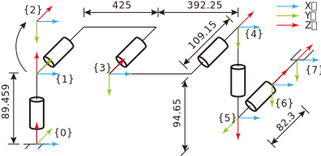

1. [UR5 configuration](#✨-ur5-configuration)
1. [Jacobian of UR5](#✨-jacobian-of-ur5)
1. [Appendix A. ur\_kinematics.m](#✨-appendix-a.-ur_kinematics.m)
1. [Appendix B. ur\_simulate.m]()

## ✨ UR5 configuration


Link parameters of the UR5 (**Modified DH**).

| $i$ | $\alpha_{i-1}$ | $a_{i-1}$ | $d_i$  | $\theta_i$ |
|-----|----------------|-----------|--------|------------|
| 1   | 0              | 0         | 89.459 |            |
| 2   | $-\pi/2$       | 0         | 0      |            |
| 3   | 0              | 425       | 0      |            |
| 4   | 0              | 392.25    | 109.15 |            |
| 5   | $-\pi/2$       | 0         | 94.65  |            |
| 6   | $\pi/2$        | 0         | 82.3   |            |


## ✨ Jacobian of UR5
### 位置分量
固连在关节 6 上的坐标系的原点位置表达式如下:
$$
{\bf{r}} = \left[ {\begin{array}{c}
{{a_3}{c_1}{c_2} + {a_4}{c_1}{c_{23}} - {d_4}{s_1} - {d_5}{c_1}{s_{234}} - {d_6}{s_1}{c_5} + {d_6}{c_1}{c_{234}}{s_5}}\\
{{a_3}{s_1}{c_2} + {a_4}{s_1}{c_{23}} + {d_4}{c_1} - {d_5}{s_1}{s_{234}} + {d_6}{c_1}{c_5} + {d_6}{s_1}{c_{234}}{s_5}}\\
d_1 - a_3s_2 - a_4s_{23} - d_5c_{234} - d_6s_{234}s_5
\end{array}} \right]
$$

由$\delta {\bf{r}} = {J_r}\delta \theta$ 得，
Jacobian 矩阵线速度分量 $J_r$ 的各列分别如下:
$$
\begin{array}{l}
\frac{\partial \bf{r}}{\partial \theta_1} =
\left[ {\begin{array}{c}
{-({a_3}{c_2} + {a_4}{c_{23}} - {d_5}{s_{234}} + {d_6}{c_{234}}{s_5}){s_1} - ({d_4} + {d_6}{c_5}){c_1}}\\
{ - ({d_4} + {d_6}{c_5}){s_1} + ({a_3}{c_2} + {a_4}{c_{23}} - {d_5}{s_{234}} + {d_6}{c_{234}}{s_5}){c_1}}\\
0
\end{array}} \right] \\

\frac{\partial \bf{r}}{\partial \theta_2} =
\left[ {\begin{array}{c}
-c_1(a_3s_2 + a_4s_{23} + d_5{c_{234}} + d_6s_{234}s_5) \\
-s_1(a_3s_2 + a_4s_{23} + d_5{c_{234}} + d_6s_{234}s_5) \\
-a_3c_2 - a_4c_{23} + d_5{s_{234}} - d_6{c_{234}}{s_5}
\end{array}} \right] \\

\frac{\partial \bf{r}}{\partial \theta_3} =
\left[ {\begin{array}{c}
{ - {c_1}({a_4}{s_{23}} + {d_5}{c_{234}} + {d_6}{s_{234}}{s_5})}\\
{ - {s_1}({a_4}{s_{23}} + {d_5}{c_{234}} + {d_6}{s_{234}}{s_5})}\\
-a_4c_{23} + {d_5}{s_{234}} - {d_6}{c_{234}}{s_5}
\end{array}} \right] \\

\frac{\partial \bf{r}}{\partial \theta_4} =
\left[ {\begin{array}{c}
-c_1({d_5}{c_{234}} + {d_6}{s_{234}}{s_5})\\
-s_1({d_5}{c_{234}} + {d_6}{s_{234}}{s_5})\\
{d_5}{s_{234}} - {d_6}{c_{234}}{s_5}
\end{array}} \right] \\

\frac{\partial \bf{r}}{\partial \theta_5} =
\left[ {\begin{array}{c}
d_6({s_1}{s_5} + {c_1}{c_{234}}{c_5})\\
d_6( - {c_1}{s_5} + {s_1}{c_{234}}{c_5})\\
-{d_6}{s_{234}}{c_5}
\end{array}} \right] \\

\frac{\partial \bf{r}}{\partial \theta_6} = 
\left[ {\begin{array}{c}
0 \\ 0 \\ 0
\end{array}} \right]
\end{array}
$$

### 姿态分量
同理，末端相对于基坐标系的姿态为
$$
{}_6^0R = \left[ {\begin{array}{ccc}
{{s_1}{s_5}{c_6} + {c_1}{c_{234}}{c_5}{c_6} - {c_1}{s_{234}}{s_6}} &
{-{s_1}{s_5}{s_6} - {c_1}{c_{234}}{c_5}{s_6} - {c_1}{s_{234}}{c_6}} &
{{c_1}{c_{234}}{s_5} - {s_1}{c_5}} \\
{-{c_1}{s_5}{c_6} + {s_1}{c_{234}}{c_5}{c_6} - {s_1}{s_{234}}{s_6}} &
{{c_1}{s_5}{s_6} - {s_1}{c_{234}}{c_5}{s_6} - {s_1}{s_{234}}{c_6}} &
{{c_1}{c_5} + {s_1}{c_{234}}{s_5}}\\
{-{c_{234}}{s_6} - {s_{234}}{c_5}{c_6}} & 
{{s_{234}}{c_5}{s_6} - {c_{234}}{c_6}} & 
{ - {s_{234}}{s_5}}
\end{array}} \right]
$$

小角度下 ($q_w\to0$) 为避免使用除法进行计算，旋转矩阵转换为四元数的公式为[^quaternion]:
$$
4\left[\begin{array}{c}q_w^2\\q_x^2\\q_y^2\\q_z^2\end{array}\right] = 
\left[ {\begin{array}{cccc}
1 & 1 & 1 & 1 \\ 1 & -1 & -1 & 1 \\ -1 & 1 & -1 & 1 \\ -1 & -1 & 1 & 1
\end{array}} \right]
\left[ {\begin{array}{c}
r_{11} \\ r_{22} \\ r_{33} \\ 1
\end{array}} \right]
$$

以 $q_x$ 和 $\theta_1$ 对应的 Jacobian 分量为例，
将 $4q_x^2 = {r_{11}} - {r_{22}} - {r_{33}} + 1$ 两边同时对 $\theta_1$ 取微分得:

$$
\begin{array}{rl}
8{q_x}\frac{{\partial {q_x}}}{{\partial {\theta _1}}} =& 
\frac{{\partial {r_{11}}}}{{\partial {\theta _1}}} - 
\frac{{\partial {r_{22}}}}{{\partial {\theta _1}}} - 
\frac{{\partial {r_{33}}}}{{\partial {\theta _1}}}\\
\frac{{\partial {q_x}}}{{\partial {\theta _1}}} =& 
\frac{{\partial {r_{11}}/\partial {\theta _1} - 
\partial r_{22}/\partial {\theta _1} - \partial {r_{33}}/\partial {\theta _1}}}
{{4\sqrt {{r_{11}} - {r_{22}} - {r_{33}} + 1} }}
\end{array}
$$

下表展示了旋转矩阵中主对角线上的元素对各关节角的偏微分。
| $\partial r\mathord{\left/\right.}\partial q$ | r11   | r22   | r33   |
|:---:|:-----:|:-----:|:-----:|
| $\theta_1$ | $c_1s_5c_6-s_1c_{234}c_5c_6+s_1s_{234}s_6$  | $-s_1s_5s_6-c_1c_{234}c_5c_6-c_1s_{234}c_6$ | $0$ |
| $\theta_2$ | $-c_1s_{234}c_5c_6-c_1c_{234}s_6$           | $s_1s_{234}c_5s_6-s_1c_{234}c_6$ | $-c_{234}s_5$ |
| $\theta_3$ | $-c_1s_{234}c_5c_6-c_1c_{234}s_6$           | $s_1s_{234}c_5s_6-s_1c_{234}c_6$ | $-c_{234}s_5$ |
| $\theta_4$ | $-c_1s_{234}c_5c_6-c_1c_{234}s_6$           | $s_1s_{234}c_5s_6-s_1c_{234}c_6$ | $-c_{234}s_5$ |
| $\theta_5$ | $s_1c_5c_6-c_1c_{234}s_5c_6$                | $c_1c_5s_6+s_1c_{234}s_5s_6$ |     $-s_{234}c_5$ |
| $\theta_6$ | $-s_1s_5s_6-c_1c_{234}c_5s_6-c_1s_{234}c_6$ | $c_1s_5c_6-s_1c_{234}c_5c_6+s_1s_{234}s_6$ | $0$ |

由 $\dot q = J_\omega {\dot \theta}$ 得，
$[q_x, q_y, q_z]^T$ 对应的 Jacobian 矩阵分量的各列为各关节角的方向向量，即:
$$
J_\omega = \left[ {\begin{array}{cc}
0 & { - {s_1}} & -s_1 & -s_1 & -c_1{s_{234}} &  - {s_1}{c_5} + {c_1}{c_{234}}{s_5} \\
0 & {{c_1}}    & c_1  & c_1  & -s_1{s_{234}} & {c_1}{c_5} + {s_1}{c_{234}}{s_5}    \\   
1 & 0          & 0    & 0    & -c_{234}      &  - {s_{234}}{s_5}                  
\end{array}} \right]
$$


[^quaternion]: Tomas K.M, Eric H, Naty H. Real Time Rendering 4th Edition, p80-p81, 2008.


## ✨ Appendix A. ur\_kinematics.m
```matlab
%% Begin
clear; clc;

% note:
% 以 dq1 为变量合并同类项
% collect(expresion, dq1);
% 化简
% simplify(expresion)

%% Set Parapeters
% DH parameters;
syms a3 a4 d1 d4 d5 d6;
% a3 = 425;
% a4 = 392.25;
% d1 = 89.459;
% d4 = 109.15;
% d5 = 94.65;
% d6 = 82.3;

% Joints parameters
syms q1 q2 q3 q4 q5 q6;
syms dq1 dq2 dq3 dq4 dq5 dq6;
% [q1 q2 q3 q4 q5 q6] = deal(0);

%% Transformation
R01 =  [cos(q1), -sin(q1), 0;
    sin(q1), cos(q1), 0;
    0, 0, 1];
P01 = [0; 0; d1];
T01 = [R01, P01;
  0, 0, 0, 1];

R12 = [cos(q2), -sin(q2), 0;
    0, 0, 1;
    -sin(q2), -cos(q2), 0];
P12 = [0; 0; 0];
T12 = [R12, P12;
  0, 0, 0, 1];

R23 = [cos(q3), -sin(q3), 0;
    sin(q3), cos(q3), 0;
    0, 0, 1];
P23 = [a3; 0; 0];
T23 = [R23, P23;
  0, 0, 0, 1];

R34 = [cos(q4), -sin(q4), 0;
    sin(q4), cos(q4), 0;
    0, 0, 1];
P34 = [a4; 0; d4];
T34 = [R34, P34;
  0, 0, 0, 1];

R45 = [cos(q5), -sin(q5), 0;
    0, 0, 1;
    -sin(q5), -cos(q5), 0];
P45 = [0; d5; 0];
T45 = [R45, P45;
  0, 0, 0, 1];

R56 = [cos(q6), -sin(q6), 0;
    0, 0, -1;
    sin(q6), cos(q6), 0];
P56 = [0; -1*d6; 0];
T56 = [R56, P56;
  0, 0, 0, 1];

%% Kinematics
% R06 = R01*R12*R23*R34*R45*R56;
% T14 = T12*T23*T34;
% T06 = T01*T12*T23*T34*T45*T56
% simplify(T06);

[w,v] = deal(zeros(3,6));

w00 = [0; 0; 0];
v00 = [0; 0; 0];

w11 = R01.'*w00 + [0; 0; dq1];
v11 = R01.'*(v00 + cross(w00,P01));
v01 = v00 + cross(w00,P01);

w22 = R12.'*w11 + [0; 0; dq2];
v22 = R12.'*(v11 + cross(w11,P12));
v02 = R01*(v11 + cross(w11,P12));
R02 = R01*R12;
w02 = R01*w11 + R02*[0; 0; dq2];

w33 = R23.'*w22 + [0; 0; dq3];
v33 = R23.'*(v22 + xtran(w22)*P23);
v03 = R02*(v22 + xtran(w22)*P23);
R03 = R02*R23;
w03 = R02*w22 + R03*[0; 0; dq3];

w44 = R34.'*w33 + [0; 0; dq4];
v44 = R34.'*(v33 + xtran(w33)*P34);
v04 = R03*(v33 + xtran(w33)*P34);
R04 = R03*R34;
w04 = R03*w33 + R04*[0; 0; dq4];

w55 = R45.'*w44 + [0; 0; dq5];
v55 = R45.'*(v44 + xtran(w44)*P45);
v05 = R04*(v44 + xtran(w44)*P45);
R05 = R04*R45;
w05 = R04*w44 + R05*[0; 0; dq5];

w66 = R56.'*w55 + [0; 0; dq6];
v66 = R56.'*(v55 + xtran(w55)*P56);
v06 = R01*R12*R23*R34*R45*(v55 + xtran(w55)*P56);
R06 = R05*R56;
w06 = R05*w55 + R06*[0; 0; dq6];

fprintf('v06 = \n');
disp(collect(v06,dq1))


function [mat] = xtran(w)
  mat = [0, -w(3), w(2);
    w(3), 0, -w(1);
    -w(2), w(1), 0];
end
```

## ✨ Appendix B. ur\_simulate.m
```matlab
%% 
clear;  clc;
global c1 c2 c3 c4 c5 c6 c23 c234 s1 s2 s3 s4 s5 s6 s23 s234;
global d1 a3 a4 d4 d5 d6;
global jcb tjcb ijcb;
global R P T;

[d1, a3, a4, d4, d5, d6] = deal(89.459, 425, 329.25, 109.15, 94.65, 82.3);
[jcb, tjcb, ijcb] = deal(zeros(6,6));
R = zeros(3,3); P = zeros(3,1); T = zeros(4,4);
T = [R, P; 0, 0, 0, 1];
pos = zeros(3,100);

%% 仿真开始
% 循环变量初始化
r2d = 180/pi; d2r = pi/180;
q = d2r.*[0; -90; 90; -90; -90; 0];
ur_calcJnt(q)

% Cartesian 空间下的速度[v; w]
dx = [0; 1; 0; 0; 0; 0];

% 循环开始
for t = 0: 10 :1000
  ur_kinematics()
  pos(:,t/10+1) = T(1:3, 4);
  ur_calcJnt(q);
  ur_jacobian();
  dq = ijcb*dx;
  q = q + dq;
end

tt = 0:10:1000;
figure;
subplot(2,2,1)
plot(tt, pos(1,:));
subplot(2,2,2)
plot(tt, pos(2,:));
subplot(2,2,3)
plot(tt, pos(3,:));

%% Functions
% 正运动学
function ur_kinematics()
  global c1 c2 c3 c4 c5 c6 c23 c234 s1 s2 s3 s4 s5 s6 s23 s234;
  global d1 a3 a4 d4 d5 d6;
  global R P T;
  hori = d4 + d6*c5;
  vert = a3*c2 + a4*c23 - d5*s234 + d6*c234*s5;

  P(1,1) = -s1*hori + c1*vert;
  P(2,1) =  c1*hori + s1*vert;
  P(3,1) = d1 - a3*s2 - a4*s23 - d5*c234 - d6*s234*s5;

  R(1,1) = c6*(s1*s5 + c1*c234*c5) - s234*c1*s6;
  R(1,2) = -s6*(s1*s5 + c234*c1*c5) - s234*c1*c6;
  R(1,3) = c234*c1*s5 - c5*s1;
  R(2,1) = -c6*(c1*s5 - c234*c5*s1) - s234*s1*s6;
  R(2,2) = s6*(c1*s5 - c234*c5*s1) - s234*c6*s1;
  R(2,3) = c1*c5 + c234*s1*s5;
  R(3,1) = -c234*s6 - s234*c5*c6;
  R(3,2) = s234*c5*s6 - c234*c6;
  R(3,3) = -s234*s5;

  T = [R, P; 0, 0, 0, 1];
end

% 计算 Jacobian 矩阵
function ur_jacobian()
  global c1 c2 c3 c4 c5 c6 c23 c234 s1 s2 s3 s4 s5 s6 s23 s234;
  global d1 a3 a4 d4 d5 d6;
  global jcb tjcb ijcb;

  jcb(:,1) = [-(a3*c2+a4*c23-d5*s234+d6*c234*s5)*s1 - (d4+d6*c5)*c1;
    -(d4+d6*c5)*s1+(a3*c2+a4*c23-d5*s234+d6*c234*s5)*c1; 0; 0; 0; 1];
  jcb(:,2) = [-c1*(a3*s2+a4*s23+d5*c234+d6*s234*s5);
    -s1*(a3*s2+a4*s23+d5*c234+d6*s234*s5);
    -a3*c2-a4*c23+d5*s234-d6*c234*s5;
    -s1; c1; 0];
  jcb(:,3) = [-c1*(a4*s23+d5*c234+d6*s234*s5);
    -s1*(a4*s23+d5*c234+d6*s234*s5);
    -a4*c23+d5*s234-d6*c234*s5;
    -s1; c1; 0];
  jcb(:,4) = [-c1*(d5*c234+d6*s234*s5);
    -s1*(d5*c234+d6*s234*s5);
    d5*s234-d6*c234*s5;
    -s1; c1; 0];
  jcb(:,5) = [d6*(s1*s5 + c1*c234*c5);
    d6*(-c1*s5 + s1*c234*c5);
    -d6*s234*c5; -c1*s234; -s1*s234; -c234];
  jcb(:,6) = [0; 0; 0;
    -s1*c5 + c1*c234*s5; c1*c5 + s1*c234*s5; -s234*s5];

  tjcb = jcb.';
  ijcb = inv(jcb);
end

% 计算各关节角的正余弦值
function ur_calcJnt(q)
  global c1 c2 c3 c4 c5 c6 c23 c234 s1 s2 s3 s4 s5 s6 s23 s234;
  c1 = cos(q(1));  s1 = sin(q(1));
  c2 = cos(q(2));  s2 = sin(q(2));
  c3 = cos(q(3));  s3 = sin(q(3));
  c4 = cos(q(4));  s4 = sin(q(4));
  c5 = cos(q(5));  s5 = sin(q(5));
  c6 = cos(q(6));  s6 = sin(q(6));
  c23 = cos(q(2)+q(3)); s23 = sin(q(2)+q(3));
  c234 = cos(q(2)+q(3)+q(4)); s234 = sin(q(2)+q(3)+q(4));
end
```


